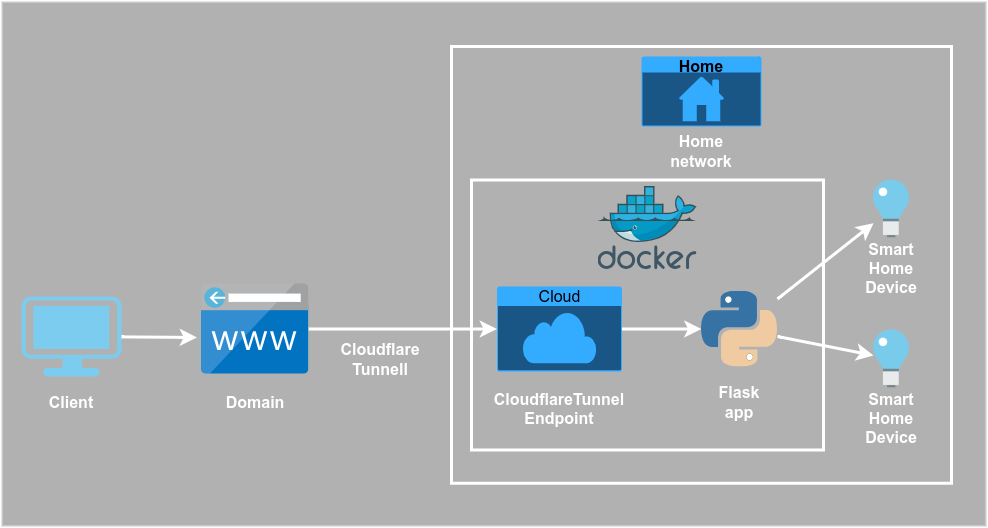

This project allows control yeelight bulb from garmin watch (or any device that can send https requests).
Prepared for working with [HttpClient](https://apps.garmin.com/en-US/apps/da241207-e929-4cdf-9662-11ab17ffd70d).

It was created for fun to resolve use case and create infrastructure. 

Here is simple diagram how it works.

### TODO
- Detect devices
    - detect
    - save ids in db

- Manage
    - set names
    - endpoints auto setup

- Endpoints 
    - one endpoint for function with device as arguent

- Functions 
    - on/of
    - timer
    - efects

- Tests